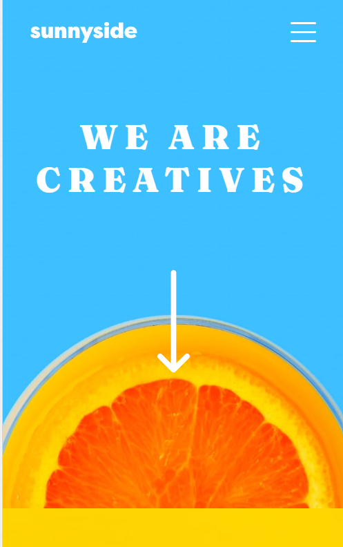

# Frontend Mentor - Sunnyside agency landing page solution

This is a solution to the [Sunnyside agency landing page challenge on Frontend Mentor](https://www.frontendmentor.io/challenges/sunnyside-agency-landing-page-7yVs3B6ef). Frontend Mentor challenges help you improve your coding skills by building realistic projects.

## Table of contents

- [The challenge](#the-challenge)
- [Screenshot](#screenshot)
- [Links](#links)
- [What I learned](#what-i-learned)
- [Continued development](#continued-development)
- [Author](#author)
- [Acknowledgments](#acknowledgments)

### The challenge

Users should be able to:

- View the optimal layout for the site depending on their device's screen size
- See hover states for all interactive elements on the page

### Screenshot

### Links

- Solution URL: https://github.com/sedcakmak/sunnyside-agency-landing-page-main
- Live Site URL: https://sedcakmak.github.io/sunnyside-agency-landing-page-main/

### Built with

- Semantic HTML5 markup
- CSS custom properties
- Flexbox
- CSS Grid
- Mobile-first workflow

### What I learned

I built the hamburger menu from scratch without copy-pasting and modifying others' codes. I also became more comfortable in using grids.

### Continued development

I would like to improve my skills in building responsive websites. Even though I constantly refactored my code, I still believe that the media queries section should be shorter.

I ran into two bugs in Chrome which I couldn't find a solution for:

The font-sizes doesn't reflect the actual value. Also, the SVG for the social media icons sometimes doesn't show up.

Both of these work on localhost Chrome and Chrome mobile as expected, but works arbitrarily on live site desktop Chrome. (It works on Safari and Microsoft Edge)

## Author

- Github - [@sedcakmak](https://github.com/sedcakmak)
- Frontend Mentor - [@sedcakmak](https://www.frontendmentor.io/profile/sedcakmak)

## Acknowledgments

Adrian's solution helped me a lot when I needed a second opinion. You can check his solution here:

https://adrianszponaronline.github.io/sunnyside-agency-landing-page-main/
